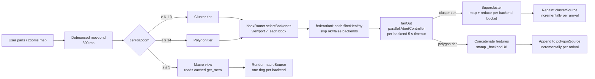

# Federation

Multiple regional instances can be aggregated into a single global map using the **Hub mode** built into this codebase. The Hub is not a separate repository — it is the same app deployed with `APP_MODE=hub`.

```
APP_MODE=standalone   →  regional map (one city / Kreis / Bundesland)
APP_MODE=hub          →  aggregation map that fetches from all registered instances
```

## Production hub setup

To run the Hub, use the same `compose.yml` and set `APP_MODE=hub`. The Hub reads a `registry.json` file listing the regional instances to aggregate:

```json
{
  "instances": [
    { "slug": "fulda",      "url": "https://fulda.example.com",      "name": "Fulda" },
    { "slug": "vogelsberg", "url": "https://vogelsberg.example.com", "name": "Vogelsberg" }
  ]
}
```

Point `REGISTRY_URL` in `.env` at the URL of this file (default: `/registry.json`, served from the app container).

## Local hub development

The compose file ships with a second backend (`db2` / `postgrest2`) pre-wired at `/api2/`. This lets you test hub mode locally with two real regions without any extra configuration.

**With full OSM import (~300 MB PBF, run once):**

```bash
# In .env: set APP_MODE=hub
make up
make import    # Fulda Stadt (454863) → db
make import2   # Neuhof (454881)      → db2 (reuses cached PBF)
make docker-build
```

**With the bundled seed fixtures (fast, no download):**

```bash
# In .env: set APP_MODE=hub
make up
make seed-load   # 4 Fulda playgrounds  → db
make seed-load2  # 5 Neuhof playgrounds → db2
make docker-build
```

Open `http://localhost:8080` — the Hub shows both regions on a shared map.

The local `registry.json` (`app/public/registry.json`) points to `/api` (Fulda) and `/api2` (Neuhof). nginx proxies both to their respective PostgREST instances.

The second backend uses `OSM_RELATION_ID2` from `.env` (default: `454881` = Neuhof). To test a different second region, set `OSM_RELATION_ID2` and re-run `make import2`.

## Federation endpoints

Each regional instance exposes the tiered playground API plus the federation discovery endpoint. A backend that joins a P2-capable Hub (the current code) must implement all four tier endpoints — see [API reference](api.md) for full request/response shapes.

| Endpoint | Description | Used at |
|---|---|---|
| `GET /api/rpc/get_meta` | Instance metadata: OSM relation name, playground count, bounding box, completeness counts | macro tier + registry discovery |
| `GET /api/rpc/get_playground_clusters` | Pre-aggregated cluster buckets `{lon, lat, count, complete, partial, missing, restricted}` for a viewport | cluster tier (zoom ≤ `clusterMaxZoom`) |
| `GET /api/rpc/get_playgrounds_bbox` | GeoJSON FeatureCollection of polygons inside a viewport | polygon tier (zoom > `clusterMaxZoom`) |
| `GET /api/rpc/get_playground` | Single-feature lookup by `osm_id` | deeplink hydration |
| `GET /api/rpc/get_playgrounds` | **Deprecated** — region-scoped FeatureCollection. The Hub falls back to it once per backend per session if a tier RPC 404s, with a one-time warning | legacy fallback only |

CORS is enabled on `/api/` so the Hub can query instances cross-origin from the browser. Backends running pre-P1 releases (no tier RPCs, no completeness extension to `get_meta`) still join successfully — the macro view shows them as "data quality unknown" (flat gray ring) and the cluster tier silently skips them rather than burning bandwidth on a region-wide legacy fetch that would be discarded.

## Registry

The Hub discovers instances from a `registry.json` file — see the [`registry.json` reference](registry-json.md) for schema, slug rules, and the derived aggregate behaviours (aggregated bounding box, multi-backend nearest search).

## Hub UI

The Hub renders the same layout as a standalone regional map, with two additions:

```
┌────────────────────────────────────────────────────────────┐
│  [search]   [filters]               [filter]  [contribute] │
│                                                            │
│                                                            │
│                      ( map canvas )                        │
│                                                            │
│                                               [locate]     │
│                                               [zoom +/−]   │
│                                                            │
│  [🌐 2 Regionen · 413 Spielplätze]                         │
│   └ scale-line                                             │
└────────────────────────────────────────────────────────────┘
```

- **Instance pill** (bottom-left): collapsed view shows a globe icon plus aggregated `<N> Regionen · <M> Spielplätze`. While the registry is loading the pill shows a spinner; once the registry is known but backends are still fetching their data, the pill shows `<completed>/<total> Regionen` with a spinner until every backend has settled (success or error) — the fraction only appears on the first load, not on subsequent 5-min refresh polls. If the registry can't be fetched the pill turns red and reads "Registry nicht erreichbar".
- **Instance drawer**: clicking the pill slides up a drawer listing each backend with its name, version badge (from `get_meta`), and individual playground count. ESC, outside-click, or re-clicking the pill collapses it.
- **Deep-link scheme**: see the [deep-link behaviour table](registry-json.md#deep-link-behaviour) in the registry reference.

The scale-line sits just below the pill in the same bottom-left corner. All other controls (search, filters, locate, zoom, contribute) are shared with standalone mode and behave identically.

## Scale and clustering

The Hub is designed to stay responsive across two and thirty backends without any per-deployment tuning. It does this with three zoom tiers and a bbox router, so a Europe-wide viewport doesn't pull every polygon from every backend, and a city-block viewport doesn't ship a redundant continental aggregate.

### Zoom tiers

| Zoom | Tier | What ships per backend | Where the work happens |
|---|---|---|---|
| `0–5` (`≤ macroMaxZoom`) | **macro** | nothing — uses cached `get_meta` | client renders one ring per backend at the bbox centroid |
| `6–13` (`≤ clusterMaxZoom`) | **cluster** | `get_playground_clusters(z, bbox)` returns pre-aggregated buckets | server bucketing + client re-clustering across border seams |
| `14+` | **polygon** | `get_playgrounds_bbox(bbox)` returns full GeoJSON polygons | client just concatenates per-backend polygons (each tagged with `_backendUrl`) |

`macroMaxZoom` and `clusterMaxZoom` are independent config knobs (defaults 5 and 13). The macro tier is hub-only — standalone reads `macroMaxZoom` but never enters the macro tier.

### Bbox routing — only intersecting backends are queried

Every backend's `get_meta` response carries a `bbox`. On every (debounced) moveend, the Hub intersects the current viewport with each backend's bbox and only fans out to backends whose bbox intersects. A viewport over Berlin doesn't issue a request to a Köln-only backend; a viewport spanning the German-Polish border issues parallel requests to both backends.

The bboxes are refreshed on the existing 5-minute registry poll, so a backend that extends its OSM relation mid-session sees the change at the next poll without a hub restart.

### Fan-out and progressive render

The Hub invokes each selected backend's tier RPC in parallel via a single `AbortController`. As each backend's response arrives, the matching layer (cluster or polygon source) is repainted incrementally — a fast backend's contribution shows within ~100 ms even if a slower peer takes 2 seconds. Per-backend timeout is 5 s; a backend that exceeds it is omitted from the current tier with a one-time console warning, and the map stays interactive.

Every moveend constructs a fresh `AbortController` and aborts the previous one, so superseded fan-outs cancel their in-flight per-backend requests via the inner controller.

### Cross-backend re-clustering

At the cluster tier, two backends covering adjacent regions both ship their own bucket grids. Without re-clustering, the seam at their shared border shows as two overlapping rings. The Hub feeds each backend's buckets into a per-fan-out [Supercluster](https://github.com/mapbox/supercluster) instance as weighted points and re-emits merged clusters whose `{count, complete, partial, missing, restricted}` totals are the sum of the contributing buckets — a single seamless ring per cell.

The polygon tier doesn't re-cluster — every backend's polygons render in a single vector source, each feature tagged with `_backendUrl` so selection routes back to the right backend.

### Country-level macro view

At `zoom ≤ macroMaxZoom` the Hub renders one stacked-ring per registered backend, sized by `playground_count` and segmented by the `{complete, partial, missing}` counts the P1 `get_meta` extension ships. No per-playground fetch is issued at this zoom — the rings come entirely from the cached registry metadata.

Clicking a macro ring animates `view.fit` to the backend's bbox, which lands in the cluster or polygon tier and triggers a tier fetch scoped to that backend only.

Backends marked as offline (via `federation-status.json`, when [add-federation-health-exposition](https://github.com/mfuhrmann/spieli/issues/194) ships) render as a dashed outline with their last-known count and an "offline" label, so the operator sees that the region exists but isn't currently reachable.

### Architecture flow



Each box in the cluster/polygon path runs once per moveend. Fan-out is the only step that produces network traffic; everything else is in-memory.

## See also

- [API reference](api.md) — request/response shapes for the tiered playground RPCs (`get_playground_clusters`, `get_playgrounds_bbox`, `get_playground`, `get_meta`).
- [Federated Deployment](../ops/federated-deployment.md) — step-by-step walkthrough for standing up one Hub + N data-nodes.
- [`registry.json` reference](registry-json.md) — registry schema, slug rules, derived aggregate behaviours.
